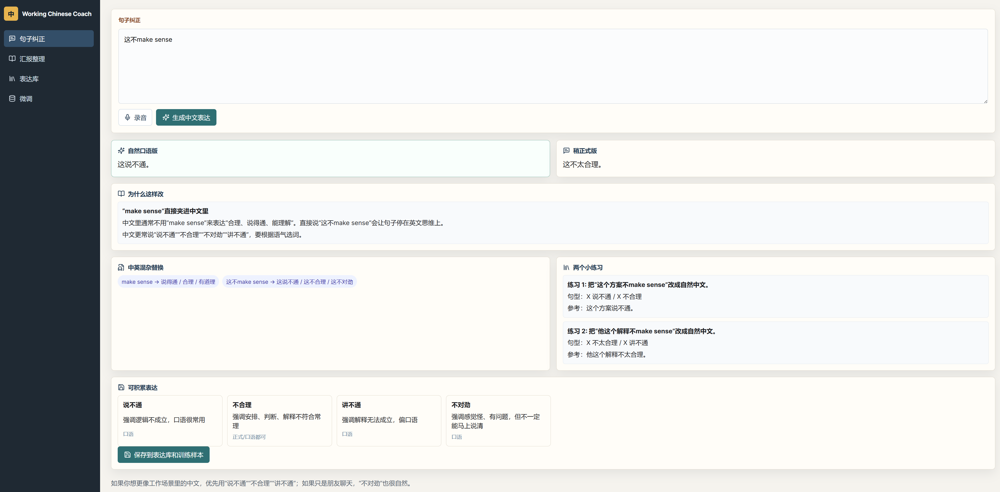

# AI_Working-Chinese_Training_Tool

A local web app for Mandarin speakers who work in English and want to rebuild natural, professional Mandarin communication habits.

This tool helps turn English-ordered Mandarin and mixed English/Mandarin workplace sentences into clear, natural Mandarin. It is designed as a communication coach, not just a translator.

## Demo

Your original sentence:

```text
我需要去 make sure 这个事情 is aligned with everyone。
```

Natural spoken Mandarin:

```text
我需要确认一下大家对这件事的理解是不是一致。
```

Slightly formal Mandarin:

```text
我需要先确认各方对这件事的理解是否一致。
```

Why:

```text
English often says "make sure something is aligned with everyone", but in workplace Mandarin it is more natural to say "确认大家理解一致".
```

## Screenshot

Place your web app screenshot here:

```text
docs/assets/demo-screenshot.png
```

After adding the image file, it will render here:



## Why This Exists

Many bilingual Mandarin speakers can speak Mandarin comfortably in daily life, but after years of working in English, their workplace Mandarin may start to sound like English syntax with Chinese words.

The goal of this project is to help users rebuild a natural Mandarin communication habit for meetings, updates, cross-team collaboration, and workplace reporting.

## Features

- Sentence correction for English-ordered Mandarin and mixed English/Mandarin input
- Report rewriting for longer meeting updates and work summaries
- Voice recording with speech-to-text transcription
- Natural spoken Mandarin and slightly formal workplace Mandarin outputs
- Explanation of sentence-order issues and English-thinking patterns
- Suggested Chinese replacements for English workplace terms
- Two short practice exercises per correction
- Reusable expression library for meetings, reports, and collaboration
- Fine-tuning dataset collection and JSONL export
- OpenAI fine-tuning job creation from saved examples
- Local SQLite database

## Tech Stack

- Frontend: React, Vite, TypeScript
- Backend: Express, TypeScript
- Database: SQLite with `better-sqlite3`
- AI: OpenAI Responses API
- Speech-to-text: OpenAI Audio Transcriptions API
- Fine-tuning: OpenAI Files API + Fine-tuning API

## Project Structure

```text
AI_Working-Chinese_Training_Tool/
  client/                 # React frontend
    src/
      components/
      lib/
      App.tsx
      styles.css
  server/                 # Express backend
    src/
      db/                 # SQLite setup and queries
      routes/             # API routes
      services/           # OpenAI integration
      index.ts
  docs/
    assets/               # Place demo screenshots here
  .env.example            # Safe example environment variables
  package.json            # Workspace scripts
```

## Requirements

- Node.js 20 or newer
- npm
- OpenAI API key

## Setup

Clone the repository:

```bash
git clone https://github.com/WennnO/AI_Working-Chinese_Training_Tool.git
cd AI_Working-Chinese_Training_Tool
```

Install dependencies:

```bash
npm install
```

Create a `.env` file in the project root:

```bash
cp .env.example .env
```

Then edit `.env`:

```env
OPENAI_API_KEY=replace_with_your_openai_api_key
OPENAI_TEXT_MODEL=gpt-5.4-mini
OPENAI_TRANSCRIBE_MODEL=gpt-4o-mini-transcribe
FINE_TUNE_BASE_MODEL=gpt-4.1-mini-2025-04-14
DATABASE_URL=file:./dev.db
PORT=8787
CLIENT_ORIGIN=http://localhost:5173
```

Initialize the local SQLite database:

```bash
npm run db:init
```

Start the frontend and backend together:

```bash
npm run dev
```

Open:

```text
http://127.0.0.1:5173
```

## Running Frontend And Backend Separately

Start the backend:

```bash
npm --workspace server run dev
```

Backend URL:

```text
http://localhost:8787
```

Start the frontend:

```bash
npm --workspace client run dev
```

Frontend URL:

```text
http://127.0.0.1:5173
```

## Available Scripts

```bash
npm run dev        # Start frontend and backend together
npm run build      # Build server and client
npm run setup      # Install dependencies and initialize database
npm run db:init    # Initialize SQLite database
```

## Environment Variables

| Variable | Description |
| --- | --- |
| `OPENAI_API_KEY` | Your OpenAI API key |
| `OPENAI_TEXT_MODEL` | Model used by the Responses API for correction and rewriting |
| `OPENAI_TRANSCRIBE_MODEL` | Model used for audio transcription |
| `FINE_TUNE_BASE_MODEL` | Base model used when creating fine-tuning jobs |
| `DATABASE_URL` | SQLite database path |
| `PORT` | Backend server port |
| `CLIENT_ORIGIN` | Allowed frontend origin for CORS |

## OpenAI APIs Used

This project uses the following OpenAI API capabilities:

- Responses API: sentence correction, report rewriting, explanations, and practice generation
- Audio Transcriptions API: voice recording to text
- Files API: upload JSONL training data
- Fine-tuning API: create and refresh fine-tuning jobs

Model availability and fine-tuning support depend on your OpenAI account and the models enabled for your project.

## Codex Skill

This repository also includes a lightweight Codex skill:

```text
skills/ai-working-chinese-coach/
```

The skill documents the Mandarin workplace coaching logic used by the app. It is useful when asking Codex to maintain prompts, generate training examples, refine correction behavior, or extend this project without changing the core product direction.

## Fine-tuning Workflow

The app can save correction results as training examples. These examples are stored locally and can be exported as JSONL through:

```text
/api/fine-tune/dataset.jsonl
```

The dataset format uses chat-style fine-tuning examples:

```jsonl
{"messages":[{"role":"developer","content":"..."},{"role":"user","content":"..."},{"role":"assistant","content":"..."}]}
```

You can create a fine-tuning job from the app's Fine-tuning page after collecting enough high-quality examples.

Fine-tuning is optional. For many personal use cases, a strong prompt plus a growing expression library may be enough.

## Privacy Notes

- The database is local SQLite by default.
- Audio files are uploaded to the local backend first, then sent to OpenAI for transcription.
- Text correction and fine-tuning requests are sent to OpenAI when you use those features.
- Do not input confidential workplace data unless you are allowed to send it to your configured API provider.

## Roadmap Ideas

- Personal error pattern tracking
- Spaced repetition practice for saved expressions
- Tone presets for manager updates, cross-team alignment, standups, and performance reviews
- Import/export expression library
- Better fine-tuning dataset review tools
- Optional multi-provider AI backend

## Contributing

Contributions are welcome. Good areas to improve include:

- Mandarin coaching prompt quality
- UI and accessibility
- Speech-to-text handling
- Dataset review tools
- Tests and validation
- Documentation

Before opening a pull request, please run:

```bash
npm run build
```

## License

MIT

---

# 中文说明

AI_Working-Chinese_Training_Tool 是一个本地 web app，面向长期在英文工作环境中工作、想重新建立自然中文职场表达习惯的中文使用者。

它不是普通翻译器，而是一个中文工作表达教练：帮助你把“英文语序的中文”和“中英夹杂的工作表达”改成更自然、更清楚、适合开会和协作场景的中文。

## Demo 示例

你的原句：

```text
我需要去 make sure 这个事情 is aligned with everyone。
```

自然口语版：

```text
我需要确认一下大家对这件事的理解是不是一致。
```

稍正式版：

```text
我需要先确认各方对这件事的理解是否一致。
```

为什么：

```text
英文里常说 “make sure something is aligned with everyone”，但中文工作场景里更自然的是“确认大家理解一致”。
```

## 截图位置

你可以把网页截图放在：

```text
docs/assets/demo-screenshot.png
```

放进去之后，README 上方的截图区域会自动显示。

## 为什么做这个项目

很多中文母语者在日常生活中可以自然说中文，但如果长期在英文环境中工作，到了会议、汇报、跨团队协作这些场景，中文表达可能会变成“中文词 + 英文语序”。

这个工具的目标是帮助用户重新建立中文职场表达习惯，而不是只给一句机械翻译。

## 功能

- 句子纠正：纠正英文语序中文和中英夹杂表达
- 汇报整理：把一长段混乱表达整理成适合会议口头汇报的中文
- 录音转文字：支持先录音再纠正
- 自然口语版和稍正式版输出
- 解释为什么原句听起来像英文思维
- 提供英文工作词的中文替代表达
- 每次纠正生成 2 个小练习
- 表达库：积累常用会议、汇报、协作表达
- 微调样本保存和 JSONL 导出
- 通过 OpenAI Fine-tuning API 创建微调任务
- 本地 SQLite 数据库

## 技术栈

- 前端：React, Vite, TypeScript
- 后端：Express, TypeScript
- 数据库：SQLite, `better-sqlite3`
- AI：OpenAI Responses API
- 录音转文字：OpenAI Audio Transcriptions API
- 微调：OpenAI Files API + Fine-tuning API

## Codex Skill

这个仓库也包含一个轻量 Codex skill：

```text
skills/ai-working-chinese-coach/
```

它不会影响 web app 的运行，只是把“中文职场表达教练”的判断方式、输出格式、训练样本标准单独沉淀下来。以后用 Codex 维护 prompt、生成训练样本、扩展功能时，可以保持这个项目的产品方向一致。

## 安装

```bash
git clone https://github.com/WennnO/AI_Working-Chinese_Training_Tool.git
cd AI_Working-Chinese_Training_Tool
npm install
cp .env.example .env
```

然后把 `.env` 里的 `OPENAI_API_KEY` 换成你自己的 OpenAI API key。

初始化数据库：

```bash
npm run db:init
```

启动前后端：

```bash
npm run dev
```

打开：

```text
http://127.0.0.1:5173
```

## 前后端分别启动

启动后端：

```bash
npm --workspace server run dev
```

启动前端：

```bash
npm --workspace client run dev
```

## 隐私说明

- 数据库默认保存在本地 SQLite 文件中。
- 录音会先上传到本地后端，再发送给 OpenAI 做转写。
- 句子纠正、汇报整理和微调相关请求会发送到 OpenAI。
- 如果内容涉及公司机密或敏感信息，请确认你有权限发送到配置的 API 服务。

## License

MIT
